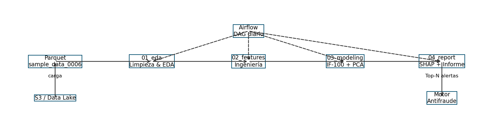

# Detección de Fraccionamiento Transaccional  
**Prueba Técnica – Nequi**

Autor: **José Manuel Machado Loaiza**  
Fecha: junio 2025

---

## 1. Propósito

Construir un flujo reproducible que:

1. **Depure** el histórico de transacciones (1,29 GB Parquet).  
2. **Genere** variables de comportamiento en ventanas 1 h / 6 h / 24 h / 7 d.  
3. **Modele** anomalías para priorizar alertas de posible fraccionamiento.  
4. **Explique** cada alerta mediante valores SHAP.

---

## 2. Competencias demostradas

| Dimensión | Evidencia |
|-----------|-----------|
| **Comprensión de negocio** | definición de fraccionamiento y métrica *recall@k* (notebook 03). |
| **Ingeniería de datos** | ingesta Parquet, validación de esquema, casting óptimo, deduplicación. |
| **EDA** | estadísticos robustos, histogramas de monto, curvas hora-día (01_eda). |
| **Feature engineering** | rolling sums/counts, z-score 7 d, flags p95/p99, codificación seno/coseno (02_features). |
| **Modelado** | Isolation Forest (100 árboles) + PCA-error (10 comp.). |
| **Buenas prácticas** | código modular en `src/`, tipado estricto, logging estandarizado. |
| **Comunicación** | Markdown técnico, tablas de umbrales, diagrama de arquitectura. |

---

## 3. Requisitos rápidos

```bash
python -m venv .venv
source .venv/bin/activate                  # Windows: .venv\Scripts\activate
pip install -r requirements.txt
````

---

## 4. Estructura del repositorio

```
artifacts/    ← modelos .joblib, ranking Top-N, architecture.png
cache/        ← parquets intermedios (clean, features)
notebooks/    ← 01_eda · 02_features · 03_modeling · 04_report
src/          ← data.py · features.py · utils.py
data/         ← sample_data_0006_part_00.parquet
requirements.txt
README.md
```

---

## 5. Instrucciones (uso vía interfaz web de GitHub)

1. Pulsa **Add file → Upload files** y sube:

   * `data/sample_data_0006_part_00.parquet`
   * carpeta `notebooks/` ejecutada
   * carpetas `src/`, `cache/`, `artifacts/`
2. Crea **README.md** y **requirements.txt** desde “Create new file”.
3. (Opc.) Abre Codespaces o Binder para ejecutar en la nube.

---

## 6. Resultados principales

| Modelo                     | Threshold Top 0.1 % | Tiempo de entrenamiento | Interpretabilidad     |
| -------------------------- | ------------------- | ----------------------- | --------------------- |
| **Isolation Forest (100)** | 0.59                | 14 min                  | SHAP Tree (500 casos) |
| PCA-10 (error reconstr.)   | 4.96                | 25 s                    | —                     |

*Las 15 variables con mayor impacto se concentran en sumas de monto y conteos
en 24 h/1 h, validando la hipótesis de fraccionamiento.*

---

## 7. Flujo operativo propuesto



* **Airflow** orquesta las etapas; el retrain es semanal.
* Scores ≥ 0.59 (≈ 1 %) se envían al motor antifraude; 0.53-0.59 a auditoría.\*

---

## 8. Próximas acciones

* Incorporar etiqueta `tx_cancelled` para medir *precision/recall* reales.
* Monitorizar deriva de `z_amt_7d` y `hour_int`; retrain si KS > 0.15.
* Exponer el modelo como micro-servicio FastAPI con explicación SHAP en línea.

---

© 2025 – MIT License

```
```

## requirements.txt

```text
pandas>=2.0
numpy>=1.24
scikit-learn>=1.3
shap>=0.43
matplotlib>=3.8
joblib>=1.3
loguru>=0.7
```

```

Copia cada bloque en la interfaz web de GitHub:

1. **README.md**  
   *“Add file → Create new file → README.md”* → pega el contenido → *Commit*.  
2. **requirements.txt**  
   Repite el proceso para el archivo de dependencias.

Sin necesidad de usar `git` local.
```
